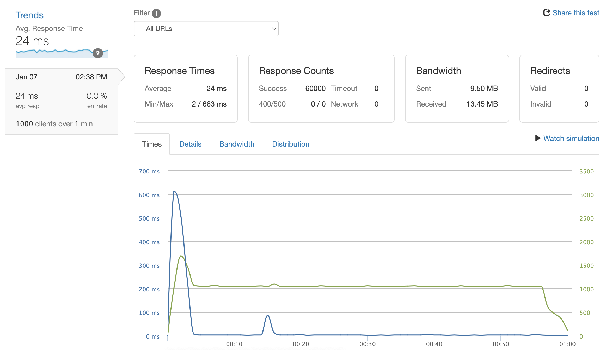
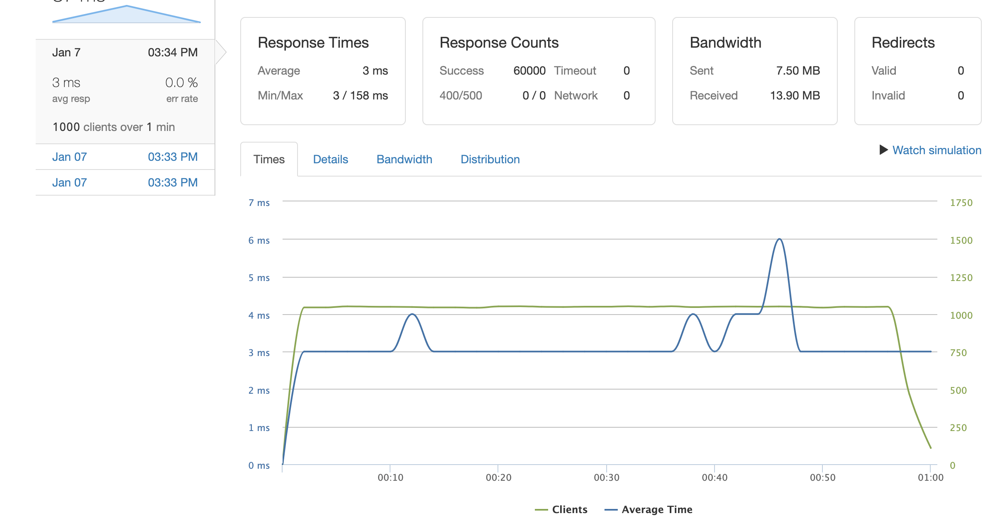
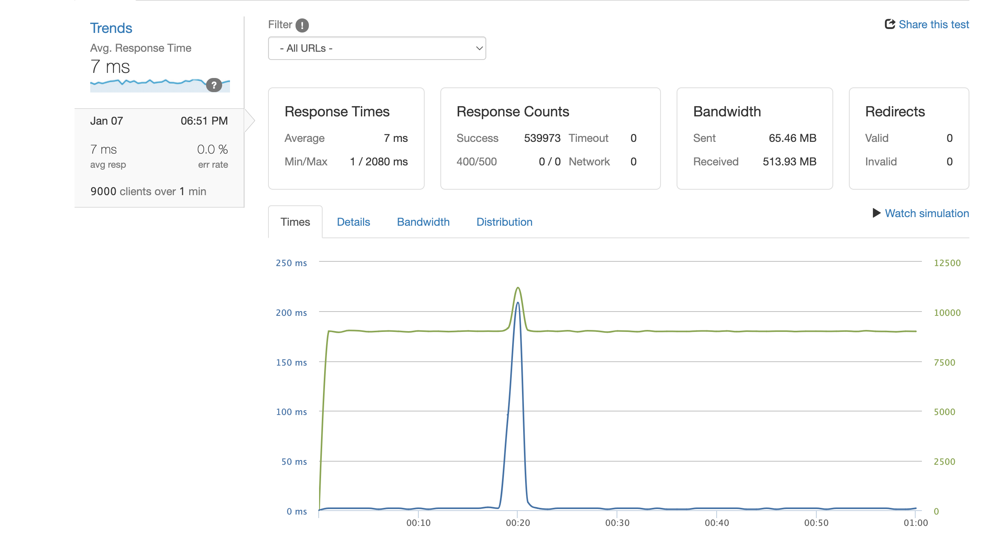

# Reviews-System-Design

##General

        This project serves as the backend design for Project Atelier, an e-commerce company. This server handles the Ratings and Reviews of the individual products. The server is implemented with node.js using express.js and the database was created with PostgreSQL.

##Performance

The backend architecture utilizes AWS and NGINX to deploy a load balancer with caching across 3 servers. These tests are performed with Loader.io.

Typical Load Performance Pre-Optimization

###Performance for a typical load of 1000 clients per second before load balancing and caching.

Typical Load Performance Post-Optimization

###Performance for a typical load of 1000 clients per second after load balancing and caching.

9000 Clients Per Second

###Performance for a load of 9000 clients per second.

